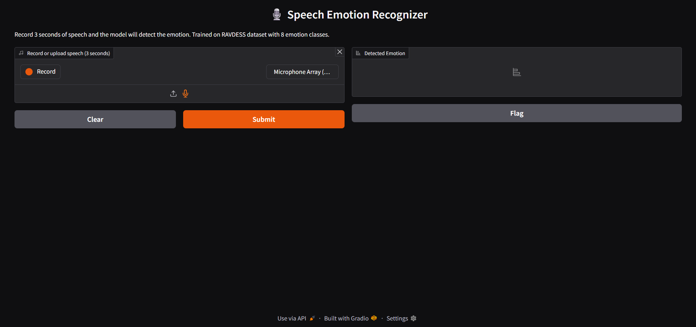
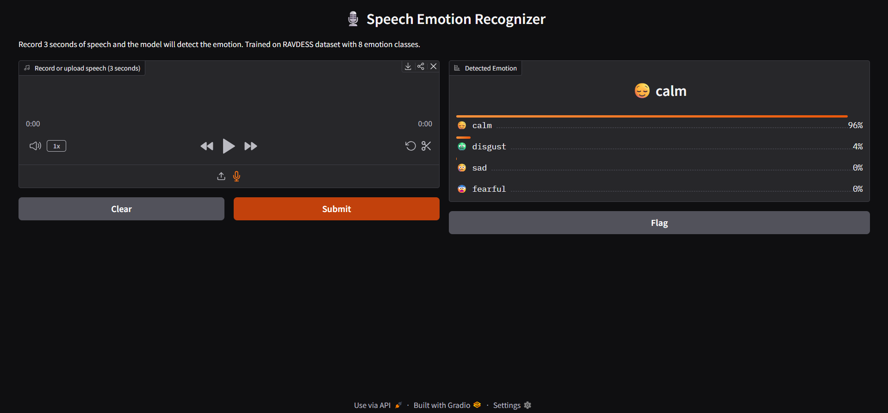

# Speech Emotion Recognizer

A deep learning app that detects emotion from speech audio using a CNN trained on the RAVDESS dataset.

🎙️ **Live Demo**: [huggingface.co/spaces/jyothi22/speech-emotion-recognizer](https://huggingface.co/spaces/jyothi22/speech-emotion-recognizer)

---

## Demo




---

## Results

| Metric | Score |
|--------|-------|
| Test Accuracy | 61% |
| Angry F1 | 0.79 |
| Surprised F1 | 0.74 |
| Fearful F1 | 0.63 |
| Classes | 8 emotions |
| Dataset | RAVDESS (1440 samples) |

---

## Emotions Detected

neutral · calm · happy · sad · angry · fearful · disgust · surprised

---

## Architecture

Raw audio → Librosa feature extraction (MFCC + Mel spectrogram + Chroma) → CNN (3 blocks) → Dense → Softmax

---

## Project Structure
```
speech_emotion_recognition/
├── data/raw/              # RAVDESS Actor_01 to Actor_24
├── src/
│   ├── dataset.py         # Parse RAVDESS filenames → labels
│   ├── extract_features.py
│   ├── model.py           # CNN architecture
│   └── train.py
├── models/
│   └── ser_model.keras
├── app/
│   └── gradio_app.py
└── assets/                # Screenshots
```
---

## Setup

```bash
git clone https://github.com/jyothi22/speech-emotion-recognition
cd speech-emotion-recognition
python -m venv venv
venv\Scripts\activate
pip install -r requirements.txt
```

---

## Run Locally

```bash
python src/train.py
python app/gradio_app.py
```

---

## Key Design Decisions

- **MFCC + Mel + Chroma** — three complementary features capture vocal tract shape, frequency energy, and pitch
- **Class weights** — balances 8 emotion classes during training
- **CNN on 2D feature map** — outperforms 1D approaches on this dataset size
- **61% accuracy on 8 classes** — 5x random chance (12.5%), honest benchmark for 1440 samples

---

## Tech Stack

Python · TensorFlow · Librosa · scikit-learn · Gradio · NumPy · Hugging Face Spaces